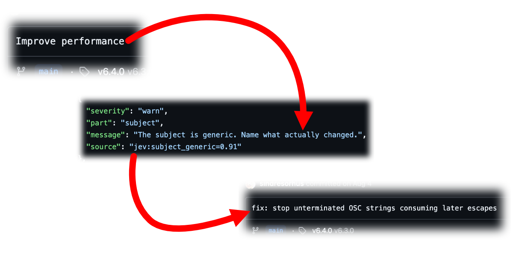

# nudgement

[Explore nudgement.dev](https://nudgement.dev) for an interactive introduction and real examples.

nudgement reviews commit messages, code, comments, tests, READMEs and UI copy.
It combines exact checks with focused questions to [TypeSafe's Jev model](https://typesafe.ai).
Use it before committing to catch things a formatter cannot: a message that
misrepresents the diff, a comment that contradicts the code, or a test that
would pass even if the behavior broke.

For example, flag overly generic commit messages so they can be made more useful:



## Run it

Install [Bun](https://bun.sh), clone this repository, and run `bun install`.
Set `JEV_API_KEY` in your environment or in a `.env` file beside `evaluate.ts`:

```dotenv
JEV_API_KEY=your-key
```

Run the file directly from this checkout:

```sh
# Review staged changes and the message you intend to commit.
bun evaluate.ts /path-to/your-repo --staged -m "fix(cli): exit successfully for --help"

# Review a README or a source file, including its functions and classes.
bun evaluate.ts /path-to/your-repo --readme
bun evaluate.ts /path-to/your-repo --file src/jev.ts

# Review another repository using an absolute path to the script.
bun /path/to/nudgement/evaluate.ts /path-to/your-repo --hash HEAD
```

Reviews send the selected text and relevant context to Jev and may incur API
charges. Requests and results are saved in this checkout's ignored `logs/`
folder. Treat those logs as source data; they can contain private code.
`NUDGEMENT_LOG_DIR` changes their location. `bun stats.ts` summarizes past runs.

## What you get

For example, the exact commit checks reject `fix: Fixed the bug.` for its past
tense and trailing period. A more useful message is
`fix(cli): exit successfully for --help`: it names the behavior being changed.
Jev also reads the diff to check whether the message is accurate.

Code reviews flag missing explanations and obscure literals, even in short
helpers. For example, a Git format string such as `%h%x00%B%x01` needs its field
and record separators explained. Clear code does not need a comment on every
function. These findings are warnings; the leanness score still measures bloat.

In tests, `expect(result).toBeDefined()` can hide a wrong result.
`expect(result).toEqual({ status: "booked", seats: 2 })` checks the actual outcome.
nudgement reports weak assertions and asks Jev whether each test checks useful
behavior. These are review suggestions, not proof that the code is correct.

See [real before-and-after examples](NUDGEMENTS.md) with the findings that prompted each change.

Reports use `✗` for errors, `!` for warnings, and `·` for notes. Only errors and
a `BLOATED` code verdict fail a review. Failed API calls also fail the review.
Scores help compare drafts; read the findings before deciding what to change.
Exit codes are 0 for pass, 1 for a
failed review, 2 for usage or Git errors, and 3 for an unexpected crash.

## Other checks

| Command options | Reviews |
| --- | --- |
| `--staged -m "…" --check-files --repo-check` | Message, comments, changed files and repository hygiene |
| `--tests tests/jev.test.ts` | Test quality |
| `--copy bench/copy/booking-confirmed.tsx` | UI text in TSX or SwiftUI |
| `--history --range main..HEAD` | Commit sequence and changes that may belong together |
| `--design bench/designs/workshop-calendar-design.md` | Whether a design is concrete and decided |
| `--plan bench/plans/workshop-calendar-plan.md --design bench/designs/workshop-calendar-design.md` | Plan quality and coverage of the design |
| `--repo-check` | Forbidden files, words and likely secrets; no API calls |

Repeat `-m` to compare message drafts. Use `--amend` for HEAD plus staged
changes, `--json` for structured output, or `--help` for all options.

An optional [nudgement.json](nudgement.json) in the repository being reviewed
can set ignored paths, commit rules, README requirements and UI product names.
See [configuration](docs/configuration.md) for an example.

## Develop

```sh
bun run check       # formatting, lint, types, offline tests and FTA
bun run coverage    # offline tests with a coverage report
bun run bench       # replay the recorded benchmark responses
```

[Testing](docs/testing.md) explains the two kinds of fixtures, response capture,
and the baseline comparison. Input samples in `bench/` and API recordings in
`tests/fixtures/` are excluded from formatting and linting.

Questions are grouped by topic in `src/*questions.ts`. Thresholds live in
`src/*rules.ts` and the evaluation modules. The
[agent skill](skills/using-nudgement/SKILL.md) describes how to use nudgement during a review.

[MIT licensed](LICENSE).
